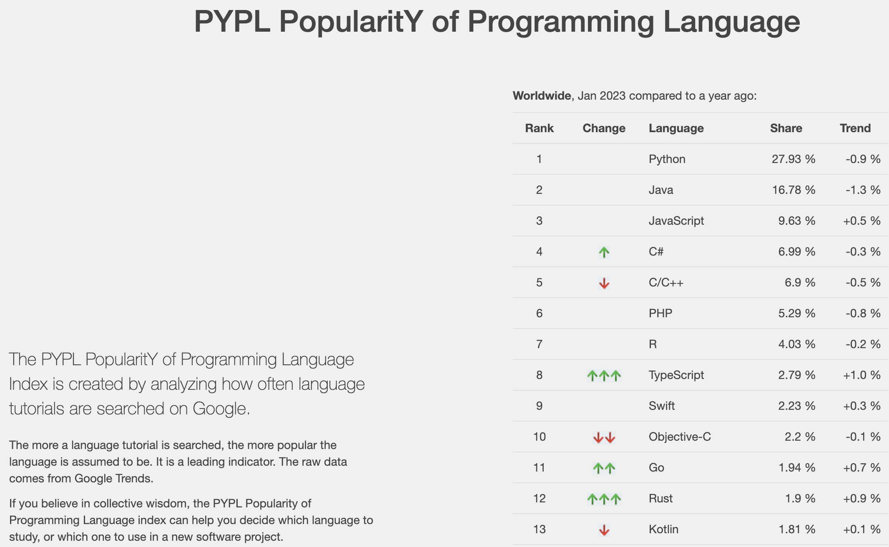

```{r setup, include=F}
knitr::opts_chunk$set(message=FALSE, warning=F, echo=F)
options(width = 2000)
options(repos="https://cran.rstudio.com")
```

# Outline

- Syllabus
- What is urban informatics?

---

# Informatics

- Informatics: the study of computational systems, especially those for data storage and retrieval

  - health informatics: To provide solutions for problems related to data, information, and knowledge processing and to study general principles of processing data information and knowledge in medicine and healthcare
  - bioinformatics: develops methods and software tools for understanding biological data, in particular when the data sets are large and complex.
  - geoinformatics: the science and the technology which develops and uses information science infrastructure to address the problems of geography, cartography, geosciences and related branches of science and engineering.

---

# Urban Informatics

Urban Informatics: an interdisciplinary approach to understanding, managing, and designing the city using systematic theories and methods based on new information technologies.


---

# Urban Informatics

- Information retrieval and storage
- Information processing & analytics
- Visualizing Information
- Information presentation and communication
- Workflow & best practices (reproducible, open data and open source)

---

# Sample projects

- [COVID cases on ourworldindata](https://ourworldindata.org/explorers/coronavirus-data-explorer?zoomToSelection=true&time=2020-03-01..latest&facet=none&pickerSort=desc&pickerMetric=new_cases_smoothed_per_million&Metric=Confirmed+cases&Interval=7-day+rolling+average&Relative+to+Population=true&Color+by+test+positivity=false&country=IND~USA~GBR~CAN~DEU~FRA)
- [COVID Map by Johns Hopkins](https://coronavirus.jhu.edu/us-map)

---

# Last year's class projects

- [20-minute neighorhood](https://canvas.pdx.edu/courses/66867/files/6959363/download?download_frd=1)
- [Portland Water Usage Neighborhood Map]()
- How COVID affected traffic pattern in Portland
- COVID's effect on Households in the US
- [Client profile of Hacienda CDC](https://rpubs.com/sarjon2/879141)

---

# Data Scienice


Source: http://drewconway.com/zia/2013/3/26/the-data-science-venn-diagram

---

# Urban Data Science Program (UC Berkeley)

> The Urban Science domain emphasis explores the theories and methods used to understand the deep structure of how cities function and the potential of urban policies and planning to shape more equitable futures. Topics include sustainability, mapping, visualization, design, urban economic analysis, smart urbanism, metropolitan structure, urban communities, and place-making, among others. 

--[UC Berkeley](https://data.berkeley.edu/degrees/domain-emphasis/urban-science)

---

# Urban Data Science series (USC)

> This course series takes a computational social science approach to working with urban data. It uses Python and Jupyter notebooks to introduce coding and statistical methods that students can reproduce and experiment with in the cloud. 

--[USC](https://github.com/gboeing/ppd599)

---

# Programming/coding

- Interacting with computers (riding buses vs driving a car)
  - via packaged software (app): easy to start; difficult for repetitive/complex tasks
  - via program/code: steeper learning curve; greater flexibility
- The best way to learn programming/coding is by doing/using it

---

# Choice of programing language

[](https://pypl.github.io/PYPL.html)

---

# Structure of the class

- Lectures: general topics; Q&A + Discussion
  - Labs: Live code session working on an actual project
- [DataCamp](https://datacamp.com): learn and practice R programming on specific topic
  - finish 9 (out of 12) courses by the end of the term
  - ideally in sync with class progress
- Class project: apply the knowledge and programming skills you learn to a real project
- Office hours: Q&A, coding help, project brainstorming; anything else
